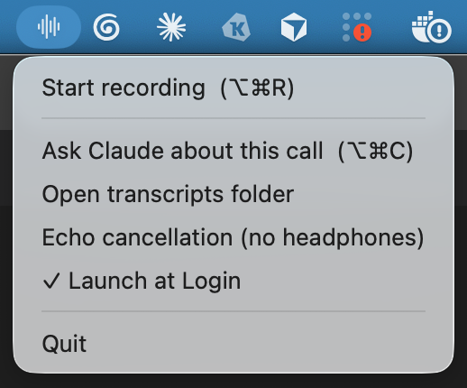
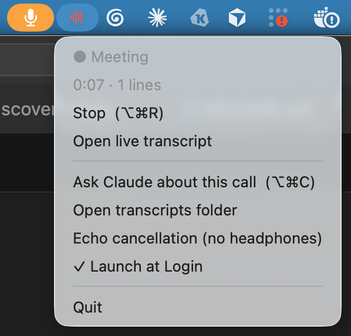

# live-recorder

reference recorder-style meeting transcription, **fully on-device**, built so the
transcript can be **streamed mid-call** to other tools.

**Why:** reference recorder has no live API — a call's transcript is only available
after it ends (and v7 encrypted the local cache, closing even the hacky
routes). So asking Claude anything *during* a call meant copy-pasting
transcript chunks into a session over and over, duplicating the same context
each time. live-recorder writes an append-only JSONL transcript to disk as
people speak, and anything can tail it: the Claude Cowork skill pulls
incrementally (each pull returns only the new lines), so one session follows
the whole call with live Q&A and zero re-pasting — and downstream projects
like local analysis tool can ride the same stream. Being on-device also means no
bot joins your call, no audio leaves your Mac, no subscription — and a voice
named once is recognized on every later call.

**How:** captures your mic + system audio as separate streams (your side and
theirs attributed for free), transcribes live (Apple SpeechAnalyzer,
macOS 26+), and labels who's speaking.

## Install the app

```bash
cd recorder && make app-install
```

Builds `LiveRecorder.app`, installs it to `/Applications`, and launches it.
Requires macOS 26+ and Xcode Command Line Tools. Your first recording
downloads the models (one time, ~a minute) and asks for permissions —
Microphone, System Audio Recording, and Calendar (only used to name
transcripts after your current meeting). Click Allow.

| Off (idle) | On (recording) |
|------------|----------------|
|  |  |

**Shortcuts** (global — they work from any app):

- **⌥⌘R** — start / stop recording. Named after your current calendar event.
- **⌥⌘C** — ask Claude about the live call: opens Claude Cowork with the
  transcript attached and `/live-recorder` ready to go.

## CLI

For terminals and scripts — `make install` puts `recorder` on your PATH:

```bash
recorder                      # record + transcribe until Ctrl-C
recorder --help               # --out, --locale, --mic-only, --system-only,
                              # --no-diarize, --aec, --speakers-dir, --diarize-file
```

Transcripts land in `~/ml/myelin/recordings/` (one `.jsonl` per call,
gitignored — never committed). Override with `$LIVE_RECORDER_DIR` or `--out`.

## Claude skill

```bash
make skill-zip                # writes ~/Downloads/live-recorder-skill.zip
```

Upload the zip at claude.ai → Settings → Capabilities → Skills. Then
`/live-recorder` in any Claude session streams the active call incrementally
(each pull returns only new lines) for live notes / research.

## Gotchas

- **No headphones? Keep echo cancellation on** (app default; CLI needs
  `--aec`), or the mic hears your speakers and remote speech bleeds into
  your "me" channel.
- Diarization is a WIP: it needs a few seconds of a new voice before it
  splits reliably, and very short interjections may get the neighbor's label.
